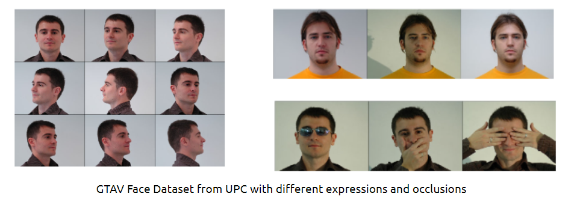
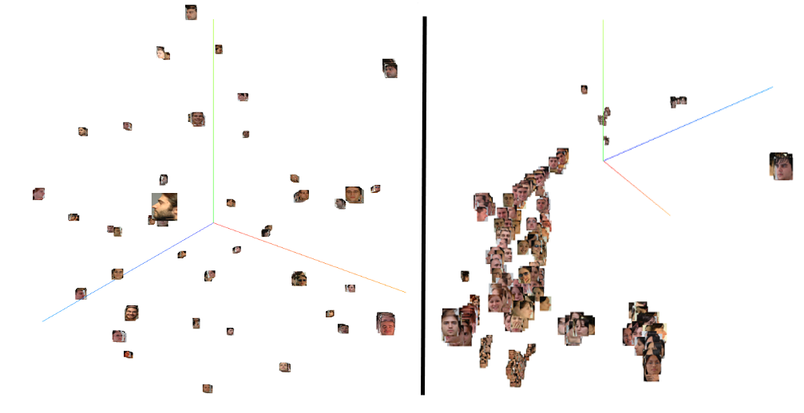

# Face ID with self-supervised contrastive learning

##Table of contents 
- [Overview](#overview)
- [Datasets](#datasets)
- [Architecture](#architecture)
  - [Contrastive Learning](#contrastive_learning)
  - [Loss function](#loss_function)
- [Running the code](#running_code)
- [Used resources](#used_resources)
- [Performance](#performance)
  - [Evaluation metrics](#evaluation_metrics)
  - [Milestone 1 : CNN + MLP (Supervised)](#milestone_1)
  - [Milestone 2 : Supervised Contrastive Learning](#milestone_2)
  - [Milestone 3 : Self-Supervised Contrastive Learning](#milestone_3)
  - [Milestone 4 : Face-ID web application](#milestone_4)
- [Conclusions](#conclusions)
- [Next Steps](#next_steps)
- [References](#references)

<a name="overview"></a>
## Overview
---
This repository is part of the final project for the UPC's Artificial Intelligence with Deep Learning posgraduate course (AIDL-2021-2022), authored by:
- Juanjo Nieto (supervisor)
- Oriol Solé
- Mario Mesas
- Carles Musoll
- Raúl Fernández


The aim of this project was to create a face identification application (Face ID) based on self-supervised learning. Recent findings by Google and Facebook  have proven that unsupervised pre-training with supervised fine-tunning can lead to higher accuracy with only 1% of the labels as its supervised counterpart. This, added to the fact that data labeling is expensive in commercial projects, led us to explore several aproaches, focusing on the self-supervised one. Extensive experimentation has been conducted architecure-wise and the results are presented hereunder.


<a name="datasets"></a>
## Datasets
---
The main datasets that have been used during this project are the following.

|DATASET                | Training     | Test        | N. of classes | Link|
|-----------------------|:--------------:|:-------------:|:--------------:|:---:|
|GTAV-FACE-DATABASE-UPC |1.2k|530|44| [Here](https://gtav.upc.edu/en/research-areas/face-database)|
|CASIA-WebFace|346.9k| 148k      | 10,575    | [Here](https://drive.google.com/file/d/1Of_EVz-yHV7QVWQGihYfvtny9Ne8qXVz/view)


GTAV-FACE-DATABASE, from UPC university, is the main dataset and it contains 1756 images of 44 different people, with different face expressions, iluminations and also different type of occlusions. 



Three different datasets have been derived from said GTAV-FACE-DATABASE with the intention of "facilitating" the learning of the networks, namely:

1. Cropped-IMGS-1: In this dataset, the original pictures have been cropped, leaving just the face itself. This cropping has been carried out by identifying the face area through a haar cascade algorithm pre-trained for such a task. with this pre-processing, we sought to eliminate information that was irrelevant to the face detection (backgrounds, t-shirts, etc.). 
2. Cropped-IMGS-2: Reduced version of the previous one, eliminating occlusion on the faces and full profile shots. 696 training images and 299 test images.
3. Cropped-IMGS-3: Reduced version of the original dataset with only frontal faces. 232 training images and 109 test images.


|DATASET                | Training     | Test. |
|-----------------------|:--------------:|:---:|
|GTAV-FACE-DATABASE-UPC |1756|530|
|Cropped-IMGS-1|1756|530|
|Cropped-IMGS-2|696|299|
|Cropped-IMGS-3|232|109|

All the different models, including the self-supervised contrastive learning one, are used to try to classify the images in an attempt to generate a facial identification application. The CASIA-WebFace dataset has only been used to pre-train the models, in order to check the influence of the dataset's size in the training of the models and the accuracy obtained. 


<a name="architecture"></a>
## Architecture (Contrastive Learning) (MOCO-V2)
---
In this project we make use of the Momentum Contrast V2 ([**MOCO-V2**](https://arxiv.org/pdf/2003.04297.pdf)), an architecture for contrastive unsupervised learning proposed by Facebook's AI research team that uses contrastive loss. It was developed as an attempt to reduce the computational constraints that come along with the well known [SimCLR](http://cse.iitkgp.ac.in/~arastogi/papers/simclr.pdf). This framework can obtain results similar to those of its supervised counterpart by making use of larger models and batch sizes, but with a considerable computing power needed.

<a name="contrastive_learning"></a>
### Contrastive Learning

Theoretically, contrastive learning is based upon the assumption that, inside the same category, different outlooks of images should have similar representations. In practice this is rarely the case. Since the categories are unknown, the actual goal is to bring the representation of the different outlooks of the same image close to each other.


The representation of different outlooks coming from the same original image are regarded as **positive pairs**, whilst those coming from different original images are called **negative pairs**. The ultimate goal of the contrastive learning is to bring positive pairs as close together as possible and negative pairs far from each other. Outlooks are obtained by applying different transformations to the original images. In this project we have used the following:
- Color Jittering
- Gaussian Blur
- Random Grayscale
- Random Horizontal Flip
- Random Crop

To differentiate between positive and negative pairs, two encoders are implemented - one for queries and one for keys. In positive pairs the query matches the key. For negative pairs, we maintain a large dictionary which contains the encoded keys from previous batches. These serve as negative samples to the current query.


<a name="loss_function"></a>
### Loss function - InfoNCE

The objective is for queries to be cloose to all their positive samples and far from the negative ones. To measure this, we use the Information Noise Contrastive Estimation(**InfoCNE**) loss function.


This was just a short and quick explanation of the used architecture and related concepts. For more in depth information you can read [this article](https://www.analyticsvidhya.com/blog/2020/08/moco-v2-in-pytorch/) along with the already linked one of MOCOV2.


<a name="running_code"></a>
## Running the code
---


1.   Clone the repo. ```git clone https://github.com/marzmesas/UPC_FaceID_CL```

2.   Install the dependencies.

  a. Install Conda from: 
        https://www.anaconda.com/products/individual#Downloads
  
  b. Create a virtual environment with Conda: ``` conda create --name venv  python=3.8 ```

  c. Activate the environment: ``` conda activate name venv ```

  d. Install the requirements: ``` pip install -r requirements.txt ```

3.   Main code (supervised/self-supervised contrastive learning): Run the ```main.py``` with the custom desired parameters:

  <ins>Run Parameters<ins> 

  *   ```supervised = True```: Boolean variable indicating the type of model (supervised: True, self-supervised: False) to run.  
  *   ```supervised_MLP = True```: Boolean variable indicating the type of supervised model (with classifier MLP on head: True, without one: False) to run.
  *   ```plot_MLP = True```: Boolean variable to plot or not the graphic that represents the loss and accuracy in the training stage of the MLP in the supervised contrastive model.
  *   ```plot_Contrastive = False```: Boolean variable to plot or not the graphic that represents the loss in the training stage of the contrastive part.
  *   ```testing_training = True```:
  *   ```training = True```: Boolean variable to train the chosen model.
  *   ```testing = False```: Boolean variable to test the chosen model (it can be done at the same time as the training).
  *   ```optim = False```: Boolean variable to decide whether or not to use the "W&B" library to optimize parameters.

  <ins>Train Parameters<ins> 

  *   ```arch = resnet18```: Variable of type string to decide which architecture to use: -resnet18, -resnet50, - resnet101, -inception resnet v1, -vgg16.
  *   ```batch_size = 16```: Integer type variable to choose the batch size for the dataset.
  *   ```epochs_contrastive = 3000```: Integer variable to set the number of epochs to train the contrastive model.
  *   ```epochs_supervisedMLP = 16```: Integer variable to set the number of epochs to train the supervised MLP model.
  *   ```K = 16```: Integer variable to set the size of the queue where the latents of the keys are stored.

4.    Run the ```app.py``` to execute the Face ID application and test it. 
  * If you are already registered press "Login" button, and a message will appear above the title indicating if the logon has been succesfully or not.
  * If you are not registered, press the "Sign up" button, and it will capture 5 images, make sure that you record different points of view of your face. If this button is pressed but you are already registered, a warning message will appear.
  * To stop/run the application press de "Stop/Start" button.

**Adittional Codes:**

1.    Full CNN+MLP model: Run the ```FULL_CNN-MLP.py``` to train a resnet-18 architecture with an MLP head composed of 3 layers 
2.    To split a dataset in train/test, run the ```Split_TrainTest.py``` where you can specify the desired % of training images for the training dataset and the rest for the test dataset.
3.    Run the ```image_cropper.py``` script to crop the images and thus have only the face of the people so that the model focuses only on features of the face and be able to achieve better results.


<a name="used_resources"></a>
## Used Resources
---


*   Laptop PC #1.

  * Intel Core i7-9750H @ 2.60GHz. 
  * 16GB RAM.
  * NVIDIA GeForce GTX 1050, 4GB VRAM.


*   Laptop PC #2.

  * Intel Core i7-8750H @ 2.20GHz. 
  * 16GB RAM.
  * NVIDIA GeForce GTX 1060, 6GB VRAM.

*   Google Cloud instance.

  * n1-highmem-2 (2 vCPUs cores)
  * 13 GB RAM memory
  * 30 GB Hard disk drive


<a name="performance"></a>
## Performance
---
In this section we present the results obtained, in chronological order, while following the roadmap established at the beginning of the project. Said roadmap included the following:
- Milestone 1 : implementation of a basic supervised model using CNN + MLP, to be used as the "ideal model" from then on.
- Milestone 2 : implementation of a model that uses contrastive learning in a supervised way.
- Milestone 3 : implementation of the final self-supervised contrastive learning.

<a name="evaluation_metrics"></a>
### Evaluation Metrics 

The metrics used to evaluate the models have been the following:

**1. Accuracy:** This metric has been used with 3 different model evaluation methods:

* K-MEANS: Through the embeddings extracted from the contrastive model, the K-Means method is used to make a cluster of the 44 theoretical classes. With the clusters obtained by K-Means, the images of the test dataset are evaluated, obtaining their embeddings and checking which is the closest cluster. With the closest cluster, we obtained the topk accuracy, based on whether any of the k closest images belong to the same person as the test image.
* K-NN: The top-k accuracy is obtained, based on whether any of the k images with the smallest distance from the image to be evaluated belongs to the same person. 

* Softmax: With the supervised models trained with a top head classifier, the accuracy has been calculated through the last softmax layer, based on whether any of the k most likely predictions match the groundtruth label.

**2. Silhouette score:** Silhouette is a function of sklearn library which allows us to obtain the number of optimal clusters with respect to the embeddings of the train dataset, the silhouette score is computed as a mean of silhouette coefficient of all samples. The silhouette coefficient is calculated using the mean intra-cluster distance and the mean nearest-cluster distance for each sample. It is a useful metric, since it allows analyzing how well the clusters have been created, as well as giving an intuition about how well the trained contrastive model has performed. This metric gives a score between -1 and 1, with 1 being the best. Values near 0 indicate overlapping clusters. Negative values generally indicate that a sample has been assigned to the wrong cluster, as a different cluster is more similar.

<a name="milestone_1"></a>
### MILESTONE 1: CNN + MLP (Supervised)

As a first base model to compare results and analyze the performance of contrastive learning based on Mocov2, a standard model of supervised training with a resnet-18 neural network is presented, in which the sequential block has been replaced by three fully connected layers reducing the number of features from 512 (resnet-18 otuput) to 44, the total number of classes for our classification task. This first approach also tries to serve as an "ideal model" and thus be able to evaluate how far the results obtained with the contrastive model are.


With this model the achieved results are the following:


|Dataset|Method| Top-K1|Top-K2|Top-K3|
|:-:|:-:|:-:|:-:|:-:|
|Cropped-IMGS-1|SoftMax  |89.00%|98.00%|99.00%
|Cropped-IMGS-2|SoftMax  |87.00%|97.00%|99.00%
|Cropped-IMGS-3|SoftMax  |80.00%|89.00%|95.00%


In the image bellow, it's observed how the loss and the accuracy evolve with respect to the number of epochs in which the model has been trained.


It is observed that as the data decreases, so does the accuracy, until it reaches a value of 80% with the smallest dataset. This happens despite the fact that of having removed images containing less information that could potentially hinder the model (such as occlusions with glasses or hands). By having fewer images in the original dataset, the model is not able to obtain higher precision if images are also removed, which, although they seem irrelevant, help the model to be more robust and more precise.


<a name="milestone_2"></a>
### MILESTONE 2: Supervised Contrastive Learning

1.1. SUPERVISED CONTRASTIVE LEARNING:


With this approach the final loss in training stage is 0.84, and the results evaluating in test datasets are:

|Dataset|Method| Top-K1|Top-K2|Top-K3|
|-|-|-|-|-|
|Cropped-IMGS-1|K-Means  |78.90%|81.68%|83.00%
|Cropped-IMGS-1|K-Neighboors|84.15%|88.17%|89.80%|
|Cropped-IMGS-2|K-Means  |79.26%|81.94%|83.62%
|Cropped-IMGS-2|K-Neighboors|85.28%|86.29%|88.96%|
|Cropped-IMGS-3|K-Means  |66.70%|68.37%|69.31%
|Cropped-IMGS-3|K-Neighboors|66.70%|70.31%|74.00%|


With representation on Tensorboard projector, latents on the Cropped-IMGS-1 training dataset (left) are perfectly clustered, improving the representation of the latents in de test dataset (right) getting a 84.15% in a TOPK1 prediction with the method of K-NN. The images that usually fail with the trained model evaluating in the test dataset are those that have occlusions and images that are completely in profile.

  

Also with Silhouette analysis, it shows that the optimum number of clusters is 44 which matches the number of classes (people). The silhouette score with this model is **0.513**, indicating that clusters are quite well defined.


For the third dataset (Cropped-IMGS-3), where the faces are just frontal shots, without any kind of oclusion, and the the training was done with 3000 epochs, the results are presented in the above table.

Silhouette analysis is used to choose an optimal value for n_clusters. In this case, silhouette analysis concludes that the best n_clusters is 48 which differs from the real 44 clusters. 

  

In this case, the silhouette score metric has dropped to **0.363**, indicating that the embeddings obtained through the model are not sufficiently defined. In addition, as can be seen in the table above, just like the silhouette score, both the accuracy of the K-Means and the K-NN have decreased. 


With Tensorboard projector the latents can be compared on the train dataset (left) and on the test dataset (right) showing that the latents are not perfect clustered for the training dataset and this is worst on test dataset where some images are mixed explaining why the accuracies are not that good in comparision with the other datasets.


#### 1.2. SUPERVISED CONTRASTIVE LEARNING WITH MLP CLASSIFIER:

With the contrastive model trained before, an MLP classifier is added on top to perform as a classifier and to try to achieve better results:

|Dataset|Method| Top-K1|Top-K2|Top-K3|
|-|-|-|-|-|
|Cropped-IMGS-1|SoftMax  |86.00%|96.99%|98.00%
|Cropped-IMGS-2|SoftMax  |88.00%|97.00%|98.00%
|Cropped-IMGS-3|SoftMax  |80.00%|85.00%|92.00%


As expected, all the accuracys improves. For the first dataset we obtain the following:


For the third one, the most restrictive of them all, we obtain:


As a conclusion, it is observed that despite having images with only frontal faces, and without occlusions or other elements that could hinder the training of the network, the results are worse, since there is not enough data, and this is one of the key points for contrastive learning.

<a name="milestone_3"></a>
### MILESTONE 3: Self-Supervised Contrastive Learning

We proceeded in the same way as in the supervised counterpart. We compute the embeddings using test datasets and get their metrics after training in self-supervised learning. That means, all images are in the same folder. Their results show that performance drops considerably.

Using the same architecture resnet18 for each dataset without pretrained weights after 3000 epochs, the metrics are:

#### Using the first dataset (Cropped-IMGS-1)

|Method| Top-K1|Top-K2|Top-K3|
|-|-|-|-|
|K-Means  |11.51%|27.36%|38.67%|
|K-Neighboors| 50.94%|67.92%|76.98%|


The results are also supported by the silhouette analysis that shows very close scores 0 (0.15) which means samples are on or very close to the decision boundary between two neighboring clusters.


At a glance, we realise that self-supervised clusters by common features such as wearing different types of sunglasses among others, but not by identity. 
This aspect would explain the number of optimal clusters given by the silhouette analysis, which in general has clustered the images by common characteristics. To avoid this problems, we leverage other datasets which not have images where people are wearing the same sunglasses.

#### Using the second dataset (Cropped-IMGS-2)

|Method| Top-K1|Top-K2|Top-K3|
|-|-|-|-|
|K-Means  |13.04%|29.09%|40.13%|
|K-Neighboors| 44.82%|62.20%|69.23%|


Using this dataset we avoid the previous issue, but another problem arises which turns out to be that self-supervised now clusters all profile pictures regardless of their identity. 
Although the optimal number of clusters in the silhouette analysis is close to the desired one, the obtained average score (0.095) is very low, even more than the one obtained in the previous dataset. This means that the clusters are far from being well defined.


For this reason, we go to the last dataset to see if we could get better results.

#### Using the third dataset (Cropped-IMGS-3)
|Method| Top-K1|Top-K2|Top-K3|
|-|-|-|-|
|K-Means  |34.58%|57.01%|63.55%|
|K-Neighboors| 48.59%|62.61%|72.89%|


At that point, we notice that using smallest dataset with only frontal faces gets better results, but they are still pretty low. One of the reasons for this poor performance could be due to the lack of data because the dataset is very limited since we have deleted a large part of the images, remaining 232 images for training and only 109 images for test, that it corresponds about 2 images per identity, fact that makes metrics unrealiable. 
Due to the small number of images in the test dataset, their embeddings appear very scattered, a fact that causes the silhouette analysis finds an optimal number of clusters much higher the desired one, specifically 61.


For the previous reasons, the following tests are carried out using the reduced dataset of GTV-FACE-DATABASE-UPC which includes more images.

The recommended changes found in the literature that could bridge the gap between self-supervised and supervised models are:
1.  Using bigger and wider models.
2.  By using larger batch and dictionary sizes.
3.  Using more data.
4.  Training large models on large amounts of data.

Bigger models are tested. For instance, a resnet50 is trained with Cropped-IMGS-2 (or reduced dataset of GTV-FACE-DATABASE-UPC). All hyperparameters, such as K (dictionary size), batch size, epochs, etc remain the same as those previously used.

|Method| Top-K1|Top-K2|Top-K3|
|-|-|-|-|
|K-Means  |18.06%|32.10%|43.81%|
|K-Neighboors| 45.81%|63.81%|70.90%|

Results are slightly better than using resnet18, but performance is still very low for all metrics.

Larger batch size is also tested using previous resnet18 setup, from 32 to 256.

|Method| Top-K1|Top-K2|Top-K3|
|-|-|-|-|
|K-Means  |20.40|32.77%|43.14%|
|K-Neighboors| 42.14%|64.55%|74.92%|

Alike bigger models, using larger batch sizes improves very slightly the performance.
Larger dictionaries are not tested since it size depends on dataset is used. 
If larger dictionary is used, it could become inconsistent since keys updated by older parameters are kept.
Thus, neither bigger models nor larger batch sizes are enough. Another way to improve results is use more data. Therefore, a reduced version of CASIA which contains about 72000 images that corrresponds to 8 images maximum for each identity is used to pretrain the network in self-supervised mode. Resulting weights after training 100 epochs are then used as initial weights for training in self-supervised mode the reduced  GTV-FACE-DATABASE-UPC database. After having trained 100 epochs, the obtained metrics are:

|Method| Top-K1|Top-K2|Top-K3|
|-|-|-|-|
|K-Means  |14.71%|31.77%|40.46%
|K-Neighboors| 45.15%|61.53%|69.89%|

In the same strategy to use more data and bigger models, a [pretrained](https://github.com/davidsandberg/facenet) [Inception Resnet](https://arxiv.org/abs/1602.07261) with VGGFACE-2 dataset consisting of ~3.3M faces and ~9000 classes is used as encoder. The problem is tacked in two differents ways: training the whole network using pretrained weights and freezing 10 first layers. In both cases results are very close. 

* Training the whole network

|Method| Top-K1|Top-K2|Top-K3|
|-|-|-|-|
|K-Means  |13.71%|37.45%|46.82%
|K-Neighboors| 45.15%|62.54%|69.23%|

* Freezing the first 10 layers

|Method| Top-K1|Top-K2|Top-K3|
|-|-|-|-|
|K-Means  |12.70%|29.76%|43.81%
|K-Neighboors| 48.49%|69.89%|79.59%|

Self Supervised Contrastive Learning on this dataset performed below our expectations. We suspect it is because firstly, the dataset is pretty tough since all classes are quite similar. We realised that those people who have some characteristic that stands out from the rest become well clustered, but those who share some characteristics are rarely well grouped in any of the tests carried out.


For instance,the girls with the bangs appears generallly well clustered.

In addition, the lighting conditions of the images have also been a feature that the algorithm has used when clustering. We believe that applying color jittering has been appropriate because images of the same person with very different color temperatures appear in the dataset because they have been taken under different lighting conditions. However, as we see in the tensorboard projector of a training dataset, the images are roughly grouped by different light conditions.


Other aspects, such as profiles, wearing glasses, etc. have also been priority aspects to cluster. Summarizing, the algorithm has focused more on a single local aspect than taking a set of them to differentiate from the rest. This means that different models have given such disparate results in terms of optimal clusters using silhouette analysis, since depending on the aspects taken in greater relevance, the number of clusters turned out to be greater or less than the number of identities.

<a name="milestone_4"></a>
### MILESTONE 4 : Face-ID web application

One of the purposes for the development of this project and on which it has been based, was to develop an application for face recognition, imitating the typical Face-ID that all mobile phones have today.

The original idea was to be able to develop this application through a model based on "self-supervised learning" in order to have the advantages of this type of learning, especially the fact that it does not need labeled data. However, as has been observed throughout the experiments carried out, due to our small dataset and the lack of computational power, the results obtained with this model are quite far from those that would be needed to be able to implement it in an environment productive.

That is why the application has been implemented with the "supervised contrastive learning" model, which has had relatively good results using the "Cropped-IMGS-2" dataset. In addition, it has been decided to use this model, since it is the closest to the model based on "self-supervised learning", which only differs in the type of images passed to the model and their transformations.


<a name="conclusions"></a>

## Conclusions
---

We have presented four approaches to face the face recognition with the perspective of comparing the performance of the self-supervised contrastive with the three supervised approaches, the supervised contrastive with and without a classification network and with the simplest version, a CNN with a classification network. It has been done in this way since the final objective of the project was to show the feasibility of integrating self-supervised contrastive with a facial recognition application.


The data reveals that the option of using self-supervised contrastive for a face recognition application is not the most appropriate, as can be seen in the obtained metrics.  In addition, we can verify that any of the networks that use MLP + Softmax as classifier provide better accuracies than using KNN.

<a name="next_steps"></a>

## Next steps
---
- VGG self supervised app
- fine tuning implementation for the last mlp layers upon 


<a name="references"></a>
## References
---
- Paper explained:Momentum Contrast for Unsupervised Visual Representation Learning [[Link](https://towardsdatascience.com/paper-explained-momentum-contrast-for-unsupervised-visual-representation-learning-ff2b0e08acfb)]
- MoCo: Momentum Contrast for Unsupervised Visual Representation Learning [[Link](https://github.com/facebookresearch/moco)]
- Improved Baselines with Momentum Contrastive Learning [[Link](https://arxiv.org/pdf/2003.04297.pdf)]
- How to reduce computational constraints using Momentum Contrast V2(MoCo-V2) in Pytorch [[Link](https://www.analyticsvidhya.com/blog/2020/08/moco-v2-in-pytorch/)]
- Supervised Contrastive Learning [[Link](https://arxiv.org/pdf/2004.11362.pdf)]
- UPC's Face Dataset [[Link](https://gtav.upc.edu/en/research-areas/face-database)]
- CASIA-WebFace Dataset [[Link](https://drive.google.com/file/d/1Of_EVz-yHV7QVWQGihYfvtny9Ne8qXVz/view)]